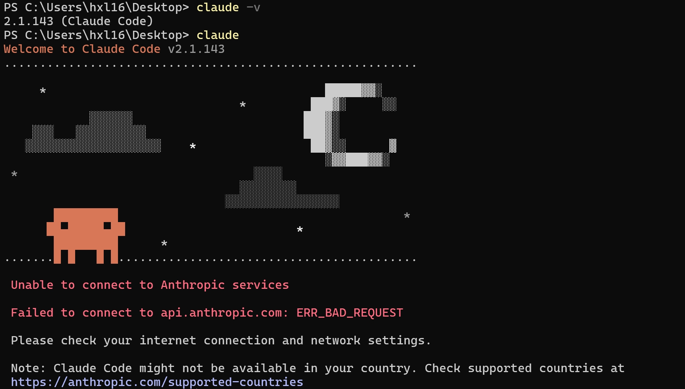
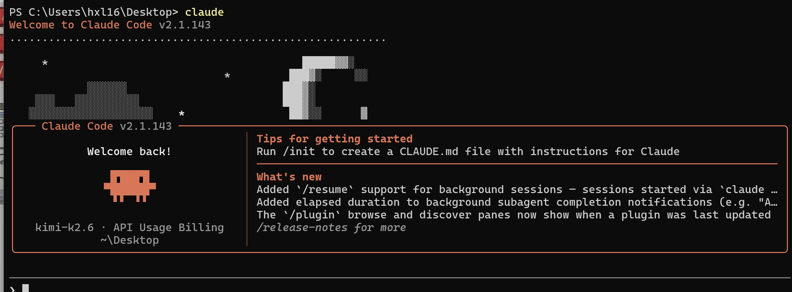

# claude code 安装和使用

## 一、claude code安装(winds)
```shell
winget install Anthropic.ClaudeCode
```
查询版本命令
```shell
claude -v
```
注:需要vpn外网,要不然很慢


## 二、切换模型
1、下载切换工具
模型切换辅助工具cc-switch,安装包地址
https://github.com/farion1231/cc-switch/releases

2、目前主流模型
已接入Kimi K2.6为例 https://platform.kimi.com/

