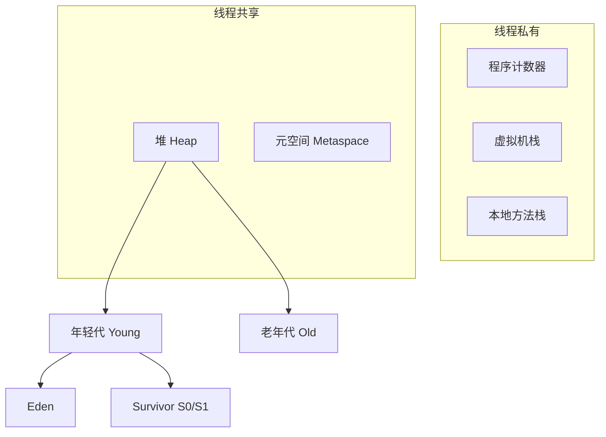
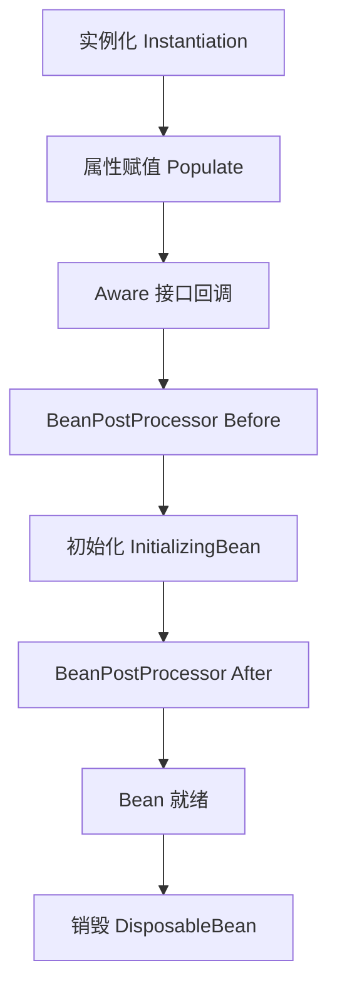
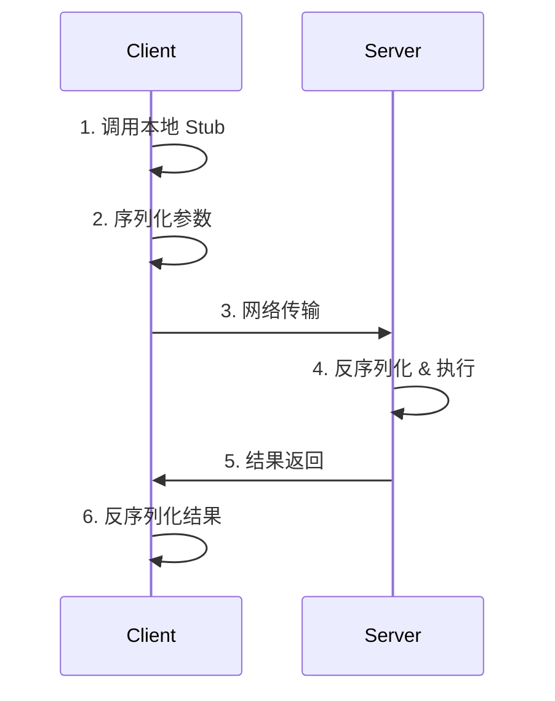

## 面试题收集1
### 1.spring boot 自动装配机制
核心原理： Spring Boot 的自动装配基于 @EnableAutoConfiguration 实现，其底层依赖 SpringFactoriesLoader 机制。
执行流程：
启动类标注 @SpringBootApplication 内部组合了 @EnableAutoConfiguration
读取 META-INF/spring.factories（Spring Boot 2.7+ 改为 META-INF/spring/org.springframework.boot.autoconfigure.AutoConfiguration.imports）
加载所有 EnableAutoConfiguration 对应的自动配置类列表
通过 @Conditional 系列注解（如 @ConditionalOnClass、@ConditionalOnProperty、@ConditionalOnMissingBean）进行条件过滤
满足条件的自动配置类被注册到 Spring 容器，完成 Bean 的自动装配
关键点：
@ConditionalOnClass：类路径存在指定类时才生效
@ConditionalOnMissingBean：容器中没有该 Bean 时才创建
spring-boot-autoconfigure 模块提供了大量预设配置

### 2.synchronized lock区别，是否可重入

| 特性 | synchronized | Lock (ReentrantLock) |
| :--- | :--- | :--- |
| **实现层面** | JVM 层面 (monitor) | JDK API 层面 |
| **锁释放** | 自动释放 | 需手动 `unlock()` |
| **等待可中断** | ❌ 不可中断 | ✅ 可中断 (`lockInterruptibly`) |
| **公平性** | ❌ 仅非公平 | ✅ 可设置公平/非公平 |
| **条件队列** | 一个隐式队列 | 多个 `Condition` 精确唤醒 |

**可重入性：** 两者均支持可重入，内部通过计数器记录重入次数。

### 3.synchronized偏向锁和重量级锁
**锁升级过程：**

- **偏向锁**：适用于单线程访问，通过比对 Mark Word 中的线程 ID 避免 CAS。
- **重量级锁**：竞争失败后阻塞线程，涉及用户态与内核态切换，开销最大。

### 4.mysql有哪些存储引擎，比较一下，索引B树和 B+树

**存储引擎对比：**

| 特性 | InnoDB | MyISAM |
| :--- | :--- | :--- |
| **事务支持** | ✅ | ❌ |
| **锁粒度** | 行锁 | 表锁 |
| **外键** | ✅ | ❌ |
| **崩溃恢复** | ✅ | ❌ |

**B树 vs B+树：**

| 特性 | B树 | B+树 |
| :--- | :--- | :--- |
| **数据存储** | 所有节点均存数据 | 仅叶子节点存数据 |
| **范围查询** | 需中序遍历，效率低 | 叶子节点链表连接，效率高 |
| **磁盘 I/O** | 树较高，I/O 次数多 | 树矮胖，I/O 次数少 |

### 5.redis集群怎么复制
**主从复制流程：**
1. **全量同步**：从节点发送 `PSYNC`，主节点执行 `BGSAVE` 生成 RDB 发送给从节点，同时将新写命令存入缓冲区。
2. **增量同步**：基于 `replicationid` 和偏移量，断线重连后若偏移量在缓冲区内，则只同步增量数据。
3. **命令传播**：主节点持续将写命令异步发送给从节点。

**Cluster 模式**：数据分片为 16384 个 slot，每个主节点带若干从节点，主节点故障时自动进行故障转移（Failover）。

### 6.redis是否能持久化
**可以。** Redis 提供两种持久化方式：
- **RDB**：定时快照，保存内存二进制数据到 `dump.rdb`。恢复快，但可能丢失最后一次快照后的数据。
- **AOF**：记录每次写命令到日志文件。安全性高（最多丢 1 秒数据），但文件体积大。支持重写压缩。
- **混合持久化（4.0+）**：AOF 重写时将当前数据以 RDB 格式写入开头，后续命令以 AOF 追加，兼顾速度与安全性。

### 7.给的java语法是否能编译
（题目未给出具体代码，常见考点如下）
- **局部变量未初始化**直接使用会报错。
- **抽象类不能直接实例化**。
- **方法重载**不能仅靠返回值不同区分。
- **final 变量**不能被重新赋值。
- **泛型类型擦除**后可能导致方法签名冲突。

### 8.做题，业务题，对递归结构查子节点
**场景**：组织架构、菜单树等。
**方案一：内存组装（推荐）**
先查出所有节点放入 Map，遍历一次建立父子关系。时间复杂度 O(N)。
**方案二：数据库递归（MySQL 8.0+）**
使用 `WITH RECURSIVE` CTE 语句进行递归查询。
**方案三：路径枚举**
表中增加 `path` 字段（如 `1/2/5`），查询子节点用 `LIKE '1/2/%'`。

### 9.jvm内存分布

- **堆（Heap）**：存放对象实例，GC 主战场。
- **元空间（Metaspace）**：存放类元数据，使用本地内存。
- **虚拟机栈**：存储栈帧，描述 Java 方法执行的内存模型。

### 10.gc分代和算法

| 算法 | 思想 | 优点 | 缺点 | 应用场景 |
| :--- | :--- | :--- | :--- | :--- |
| **标记-清除** | 标记存活，清除垃圾 | 简单 | 内存碎片 | CMS |
| **标记-复制** | 存活对象复制到另一区 | 无碎片，高效 | 浪费 50% 空间 | 年轻代 |
| **标记-整理** | 存活对象向一端移动 | 无碎片 | 停顿时间长 | G1, Parallel Old |

### 11.young gc发生时间
当 **Eden 区空间不足**时触发 Minor GC（Young GC）。此时会暂停用户线程（STW），将存活对象复制到 Survivor 区或晋升到老年代。

### 12.线程池核心参数
`ThreadPoolExecutor` 的 7 个参数：
1. `corePoolSize`：核心线程数。
2. `maximumPoolSize`：最大线程数。
3. `keepAliveTime`：非核心线程空闲存活时间。
4. `unit`：时间单位。
5. `workQueue`：任务等待队列。
6. `threadFactory`：线程工厂。
7. `handler`：拒绝策略（Abort, CallerRuns, Discard, DiscardOldest）。

### 13.spring bean 生命周期

1. **实例化**：反射创建对象。
2. **属性赋值**：依赖注入（DI）。
3. **初始化**：执行 `@PostConstruct` 或 `afterPropertiesSet`。
4. **后置处理**：AOP 代理通常在此阶段生成。

### 14.redis 基本数据类型，redis 分布式锁
**5 大基本类型**：String, Hash, List, Set, ZSet。
**分布式锁实现**：
- **基础命令**：`SET key value NX EX seconds`（原子性设置并设过期时间）。
- **Redisson**：提供可重入锁、看门狗自动续期、红锁等高级功能。解锁时使用 Lua 脚本保证原子性，防止误删他人锁。

### 15.sql索引，以及 慢sql 如何优化
**索引失效场景**：模糊查询 `%xx`、函数运算、隐式类型转换、OR 连接未全部加索引。
**慢 SQL 优化步骤**：
1. 开启慢查询日志定位 SQL。
2. 使用 `EXPLAIN` 分析执行计划（关注 type, key, rows, Extra）。
3. 优化手段：添加/优化索引、避免 `SELECT *`、优化分页、分库分表、增加缓存。

### 16.spring cloud 有哪些组件
- **注册中心**：Eureka, Nacos, Consul。
- **配置中心**：Config, Nacos Config, Apollo。
- **负载均衡**：Ribbon, LoadBalancer。
- **服务调用**：Feign, OpenFeign。
- **网关**：Zuul, Spring Cloud Gateway。
- **熔断降级**：Hystrix, Sentinel, Resilience4j。
- **链路追踪**：Sleuth + Zipkin, SkyWalking。

### 17.spring的循环依赖
**定义**：Bean A 依赖 B，B 又依赖 A。
**解决方式**：Spring 通过**三级缓存**解决单例 Setter/Field 注入的循环依赖。
- 一级：完整 Bean。
- 二级：早期引用（已实例化未填充）。
- 三级：生产早期引用的工厂（用于处理 AOP 代理）。
**无法解决的情况**：构造器注入循环依赖（需用 `@Lazy`）、Prototype 作用域。

### 18.mysql调优
1. **SQL 优化**：索引优化、避免全表扫描、覆盖索引。
2. **表结构**：合适的数据类型、分区表、反范式。
3. **配置**：调整 `innodb_buffer_pool_size`（建议物理内存 50%-75%）。
4. **架构**：读写分离、分库分表、引入 Redis 缓存。

### 19.redis缓存，穿透。
**缓存穿透**：查询数据库和缓存都不存在的数据，导致请求直达 DB。
**解决方案**：
- **缓存空值**：设置短 TTL。
- **布隆过滤器**：查询前先判断 key 是否存在。
- **参数校验**：拦截非法请求。

### 20.springclound的微服务原理，搭建以及应用
**原理**：服务拆分、注册发现、负载均衡、熔断限流、网关路由、集中配置。
**搭建（Alibaba 体系）**：
1. Nacos 作为注册/配置中心。
2. OpenFeign 进行服务间调用。
3. Gateway 作为统一入口。
4. Sentinel 实现流量控制与熔断。
5. Seata 处理分布式事务。

### 21.并发编程锁的，乐观锁，悲观锁。分布式锁，
- **悲观锁**：认为冲突一定会发生，先加锁再操作（如 `synchronized`, `SELECT FOR UPDATE`）。
- **乐观锁**：认为冲突很少发生，操作后检查版本号（CAS, 数据库 version 字段）。
- **分布式锁**：跨 JVM 进程互斥。常用 Redis (`SET NX`) 或 Zookeeper（临时顺序节点）实现。

### 22.jvm调优，垃圾回收机制。
**目标**：降低停顿时间（Latency）或提高吞吐量（Throughput）。
**主流收集器**：
- **G1**：平衡吞吐与延迟，大堆首选。
- **ZGC**：超低延迟（<10ms），适合超大堆。
**调优**：根据 GC 日志分析 Young/Full GC 频率，调整堆大小（`-Xms`, `-Xmx`）及新生代比例。

### 23.二叉树搜索
**BST 特性**：左子树 < 根 < 右子树。
**变体**：AVL（严格平衡）、红黑树（近似平衡，JDK TreeMap 使用）、B+树（数据库索引）。
**查找复杂度**：平衡时为 O(log N)，最坏为 O(N)。

### 24.对go 语言认识
**特点**：简洁、静态编译、原生高并发（Goroutine + Channel）、垃圾回收、跨平台。
**适用**：云原生基础设施（K8s, Docker）、高并发微服务、中间件。
**对比 Java**：无 JVM，启动快，内存占用低，错误处理显式。

### 25.rpc调用原理

**核心组件**：动态代理、序列化（Protobuf/Hessian）、网络通信（Netty/HTTP2）、负载均衡、服务发现。

