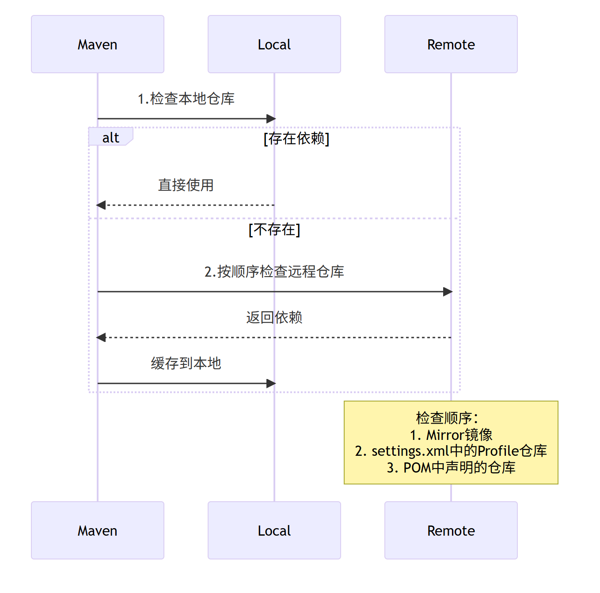

## maven 加载顺序

### 一、核心配置优先级

| 配置位置         | 生效范围     | 优先级 | 典型应用场景      |
|:-------------|:---------|:----|:------------|
| 本地仓库         | 全局       | 最高  | 优先使用本地缓存    |
| Mirror镜像     | 全局覆盖     | 高   | 加速中央仓库/统一代理 |
| settings.xml | Profile级 | 中   | 团队统一环境配置    |
| POM文件        | 项目级      | 低   | 项目特殊依赖需求    |

### 二、加载流程


### 三、加载配置说明
1、本地仓库
```xml
 <localRepository>D:\apache-maven-3.5.4\conf</localRepository>
```

2、Mirror镜像
```xml
<mirrors>
    <mirror>
        <id>alimaven</id>
        <name>aliyun maven</name>
        <url>http://maven.aliyun.com/nexus/content/groups/public/</url>
        <mirrorOf>central</mirrorOf>
    </mirror>
    <mirror>
        <id>repo3</id>
        <name>central maven</name>
        <url>http://central.maven.org/maven2/</url>
        <mirrorOf>central</mirrorOf>
    </mirror>
    <mirror>
        <id>central</id>
        <name>Maven Repository Switchboard</name>
        <url>http://repo1.maven.org/maven2/</url>
        <mirrorOf>central</mirrorOf>
    </mirror>
    <mirror>
        <id>repo2</id>
        <mirrorOf>central</mirrorOf>
        <name>Human Readable Name for this Mirror.</name>
        <url>http://repo2.maven.org/maven2/</url>
    </mirror>
</mirrors>
```

3、Profile级
```xml
 <profiles>
    <profile>
        <id>custom</id>
        <repositories>
            <repository>
                <id>internal-repo</id>
                <url>http://repo.internal.com</url>
                <!-- 优先级高于pom中的仓库 -->
                <releases>
                    <enabled>true</enabled>
                    <updatePolicy>daily</updatePolicy>
                </releases>
            </repository>
        </repositories>
    </profile>
</profiles>
```

4、POM文件
```xml
<repositories>
    <repository>
        <id>thirdparty</id>
        <url>http://nexus.company.com/repo</url>
    </repository>
</repositories>
```


