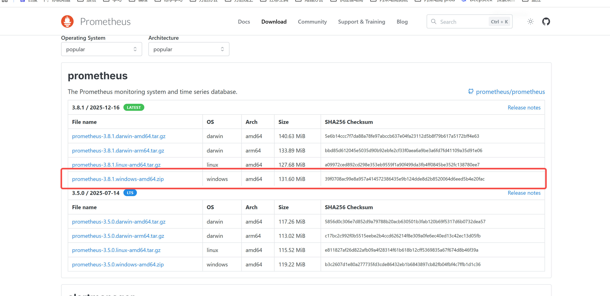
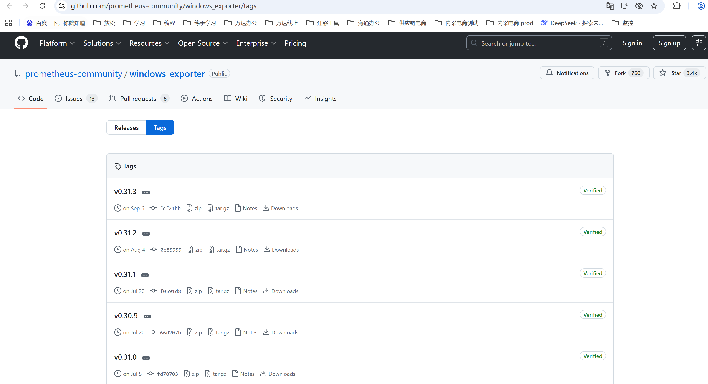
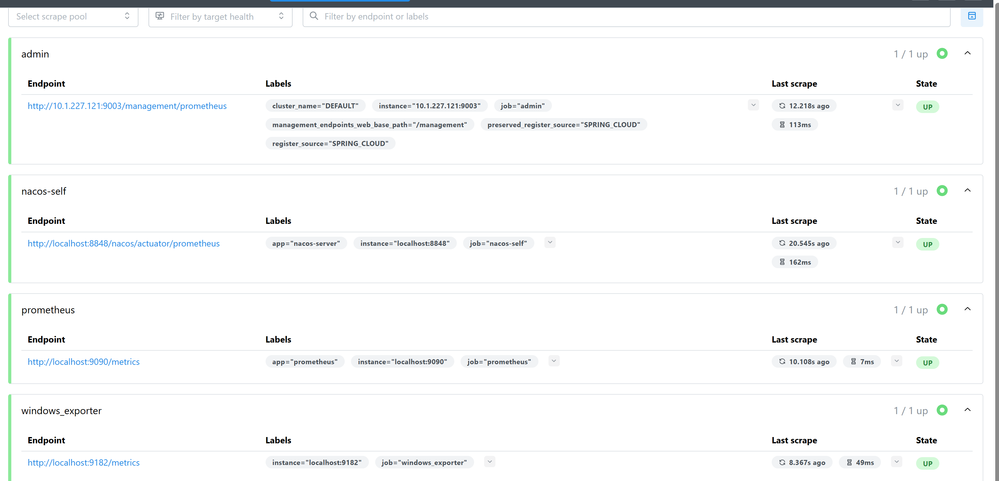

## prometheus配置
为了方便测试 在wind 下安装测试,其他系统下载对应包即可
参考文献：https://cloud.tencent.com/developer/article/2288906

作用：     
数据收集： Prometheus 是一个开源的系统监控和报警工具，主要用于收集、存储和查询时间序列数据。它通过 HTTP 抓取（scrape）方式从被监控的目标获取数据。   
数据存储：Prometheus 使用时间序列数据库来存储所有收集到的指标数据。时间序列数据包括指标名称和标签，标签用于唯一标识时间序列。    
数据查询：Prometheus 提供了一种强大的查询语言 PromQL，可以用来查询和分析收集到的数据（虽然语法强大， 但是还是不如可视化 。哈哈，所以要和grafana配合起来）。 
告警： Prometheus 内置告警管理器（Alertmanager），可以根据预定义的规则触发告警，并将告警发送到各种通知渠道（如邮件、Slack、PagerDuty 等）。   


### 一、安装
官网下载:[https://prometheus.io](https://prometheus.io/)


### 二、集成配置
#### 1、prometheus
```yaml
- job_name: "prometheus"

    # metrics_path defaults to '/metrics'
    # scheme defaults to 'http'.

    static_configs:
      - targets: ["localhost:9090"]
        labels:
          app: "prometheus"
```

#### 2、集成windows的一些指标参数
[下载插件](https://github.com/prometheus-community/windows_exporter/tags)


启动插件-配置
```yaml
- job_name: 'windows_exporter'
    static_configs:
      - targets: ['localhost:9182']
```
<span style="color:#ff0000">
其他插件：     
node_exporter：监控服务器资源         
mysqld_exporter:监控数据库
</span>

#### 3、集成nacos
3.1 放开配置
```properties
management.endpoints.web.exposure.include=prometheus,health
nacos.prometheus.metrics.enabled=true
```
3.2 wind 下单机启动: 
```shell
./startup.cmd -m standalone
```
3.3 集成
默认地址: http://localhost:8848/nacos/actuator/prometheus
```yaml
- job_name: 'nacos-self'
  metrics_path: 'nacos/actuator/prometheus'  
  static_configs:
  - targets: ['localhost:8848']
  labels:
  app: "nacos-server"
  scrape_interval: 30s
```

#### 4、集成注册到nacos下服务
示例：
```yaml
- job_name: "admin"
    http_sd_configs:
      - url: "http://localhost:8848/nacos/prometheus/namespaceId/2c53b834-a5f6-42fd-910a-7059b6577831/service/admin"
        refresh_interval: 10s  
    relabel_configs:
      # 1. 从返回的 labels 中提取 management_endpoints_web_base_path，拼接 Prometheus 指标端点
      - source_labels: [management_endpoints_web_base_path]
        target_label: __metrics_path__  # 重写抓取路径（Prometheus 内置标签）
        replacement: ${1}/prometheus    # 拼接为 /management/prometheus（适配 SpringBoot Actuator）
      # 2. 保留有用的元标签（添加到指标中，方便筛选）
      - source_labels: [__meta_clusterName]
        target_label: cluster_name      # 集群名称标签
        replacement: ${1}
      - source_labels: [preserved_register_source]
        target_label: register_source   # 服务注册来源标签
        replacement: ${1}
```

### 三、集成演示结果
1、集成示例：
```yaml
# my global config
global:
  scrape_interval: 15s # Set the scrape interval to every 15 seconds. Default is every 1 minute.
  evaluation_interval: 15s # Evaluate rules every 15 seconds. The default is every 1 minute.
  # scrape_timeout is set to the global default (10s).

# Alertmanager configuration
alerting:
  alertmanagers:
    - static_configs:
        #- targets: ['localhost:9090']

# Load rules once and periodically evaluate them according to the global 'evaluation_interval'.
rule_files:
  # - "first_rules.yml"
  # - "second_rules.yml"

# A scrape configuration containing exactly one endpoint to scrape:
# Here it's Prometheus itself.
scrape_configs:
  # The job name is added as a label `job=<job_name>` to any timeseries scraped from this config.
  - job_name: "prometheus"

    # metrics_path defaults to '/metrics'
    # scheme defaults to 'http'.

    static_configs:
      - targets: ["localhost:9090"]
        labels:
          app: "prometheus"
  - job_name: 'windows_exporter'
    static_configs:
      - targets: ['localhost:9182']
  - job_name: 'nacos-self'
    metrics_path: 'nacos/actuator/prometheus'  
    static_configs:
      - targets: ['localhost:8848']
        labels:
          app: "nacos-server"
    scrape_interval: 30s
  - job_name: "admin"
    http_sd_configs:
      - url: "http://localhost:8848/nacos/prometheus/namespaceId/2c53b834-a5f6-42fd-910a-7059b6577831/service/admin"
        refresh_interval: 10s  
    relabel_configs:
      # 1. 从返回的 labels 中提取 management_endpoints_web_base_path，拼接 Prometheus 指标端点
      - source_labels: [management_endpoints_web_base_path]
        target_label: __metrics_path__  # 重写抓取路径（Prometheus 内置标签）
        replacement: ${1}/prometheus    # 拼接为 /management/prometheus（适配 SpringBoot Actuator）
      # 2. 保留有用的元标签（添加到指标中，方便筛选）
      - source_labels: [__meta_clusterName]
        target_label: cluster_name      # 集群名称标签
        replacement: ${1}
      - source_labels: [preserved_register_source]
        target_label: register_source   # 服务注册来源标签
        replacement: ${1}
```
2、演示结果

