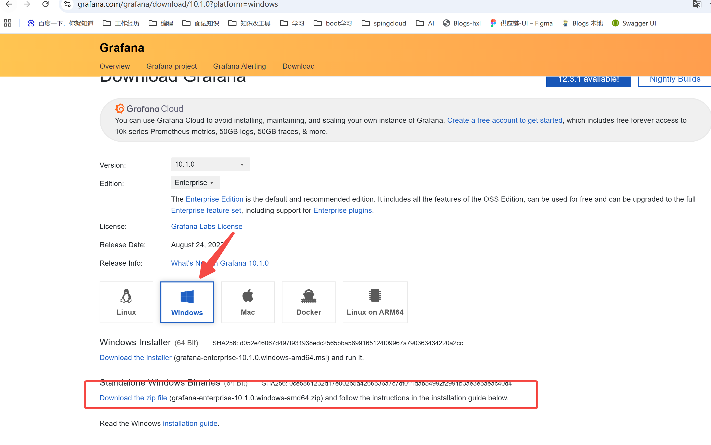
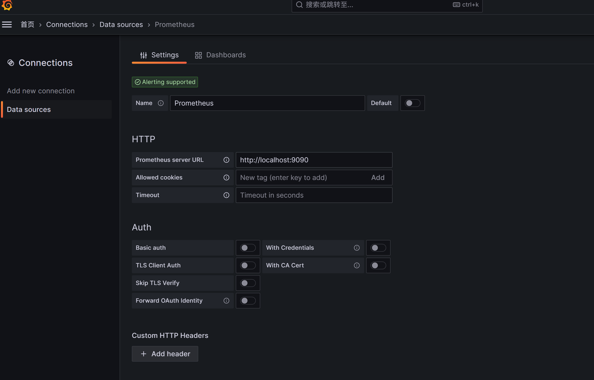
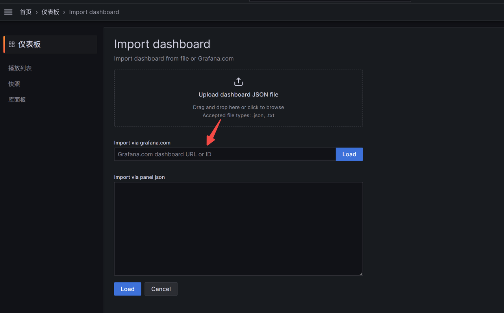
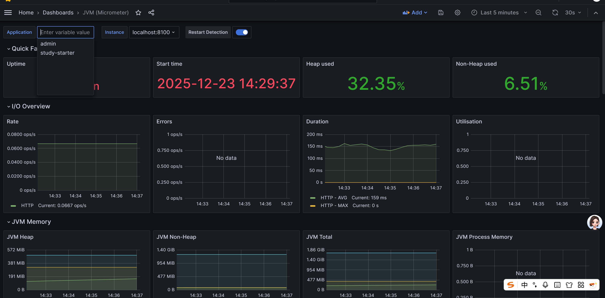

## grafana
数据可视化：Grafana 是一个开源的平台，用于数据可视化和分析。它能够连接到多种数据源，并将数据以各种形式（图表、表格、仪表盘等）展示出来。    
仪表盘：Grafana 提供丰富的仪表盘功能，可以用来创建和共享实时的动态仪表盘。用户可以通过拖拽组件轻松构建仪表盘。     
多数据源支持：Grafana 支持多种数据源，包括 Prometheus、Graphite、InfluxDB、Elasticsearch、MySQL、PostgreSQL 等。    
告警：Grafana 也支持告警功能，用户可以在图表上设置告警规则，并通过通知渠道（如邮件、Slack、PagerDuty 等）接收告警。       

方便测试,在wind下配置测试

### 一、下载、安装、启动
[下载地址](https://grafana.com/grafana/download?platform=windows)

### 二、配置数据源

### 三、配置监控模版
模版地址：https://grafana.com/grafana/dashboards/

常见模id     
wind：10467      
JVM：12856、12377     
sping boot官方默认：4701、12856
21319

### 四、设置告警
