# mongodb 安装

## 一、lunx下载、安装
### 1、检查服务器 命令：hostnamectl
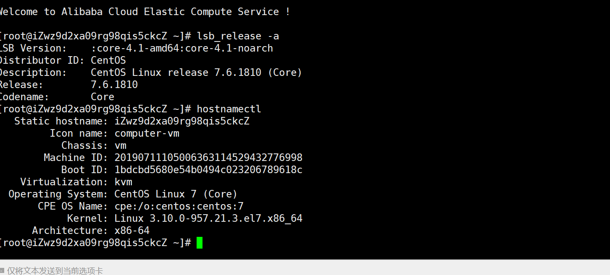
支持版本： 
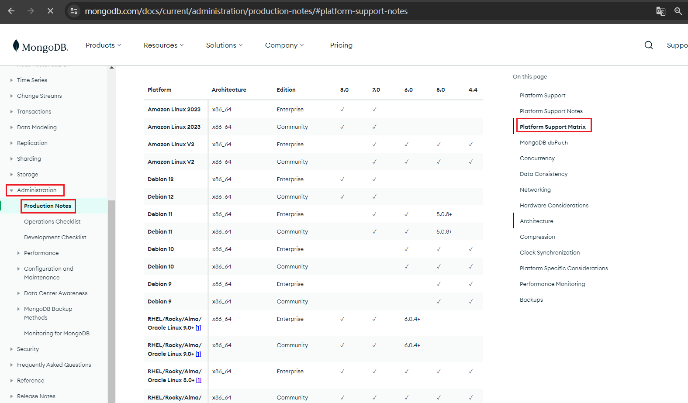


下载地址：
[https://www.mongodb.com/try/download/community](https://www.mongodb.com/try/download/community)
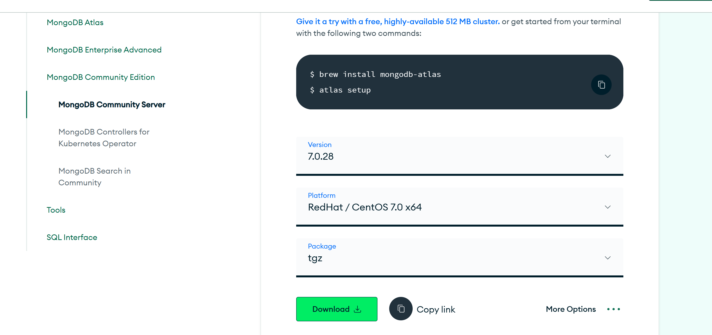
### 2、解压
tar -xzvf mongodb-linux-x86_64-rhel70-7.0.28.tgz

### 3、新增文件夹和配置文件mongod.conf
mkdir -p data
mkdir -p log
touch log/mongodb.log

新增mongod.conf
```shell
# 数据存储位置
dbpath=/usr/local/opt/mongodb-linux-x86_64-rhel70-7.0.28/data/

# 日志存储位置
logpath=/usr/local/opt/mongodb-linux-x86_64-rhel70-7.0.28/log/mongodb.log

# 运行时占用端口
port=27017

# fork为true指明以后台方式启动
fork=true
```

### 4、启动服务
cd bin/
```shell
./mongod -f /usr/local/opt/mongodb-linux-x86_64-rhel70-7.0.28/mongod.conf
```
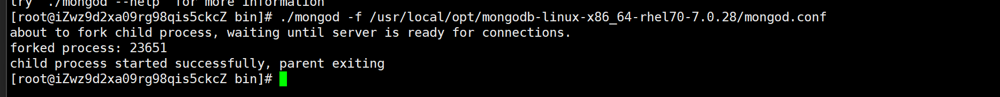

### 5、关闭服务
```shell
sudo netstat -tlnp | grep :27017
kill -9 25582
```

6、bin下目录说明
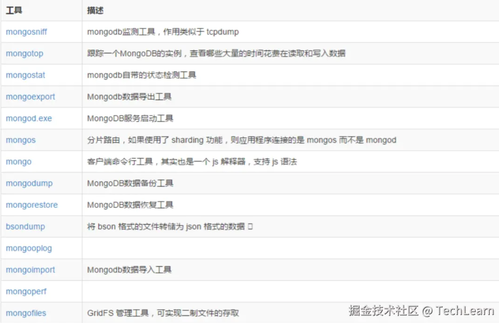

## 二、创建账号，设置远程链接
注：MongoDB从6.0.10及其之后版本中，bin目录下就没有mongo可执行文件，则需要单独安装官方客户端命令行工具MongoDB shell来连接进行数据库操作，
它不支持图形用户页面      

### 1、下载本地连接工具
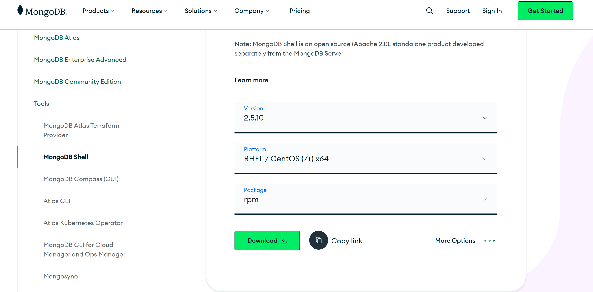

### 2、安装工具
```shell
rpm -ivh mongodb-mongosh-2.5.10.x86_64.rpm
```
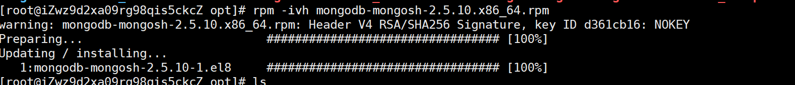

查询安装地址：
```shell
rpm -ql mongodb-mongosh
```
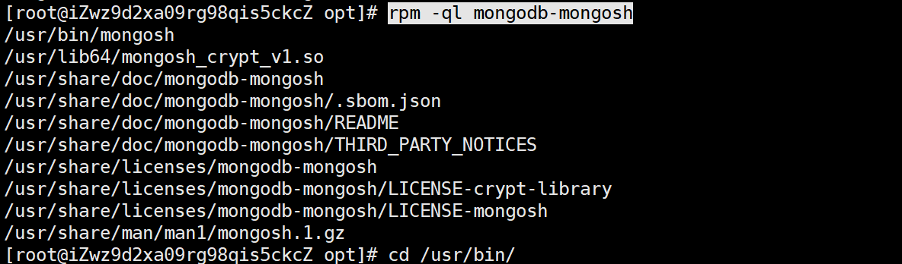
/usr/bin 下mongosh


### 3、设置登录认证
/usr/bin下mongosh
```shell
./mongosh mongodb://127.0.0.1:27017
```
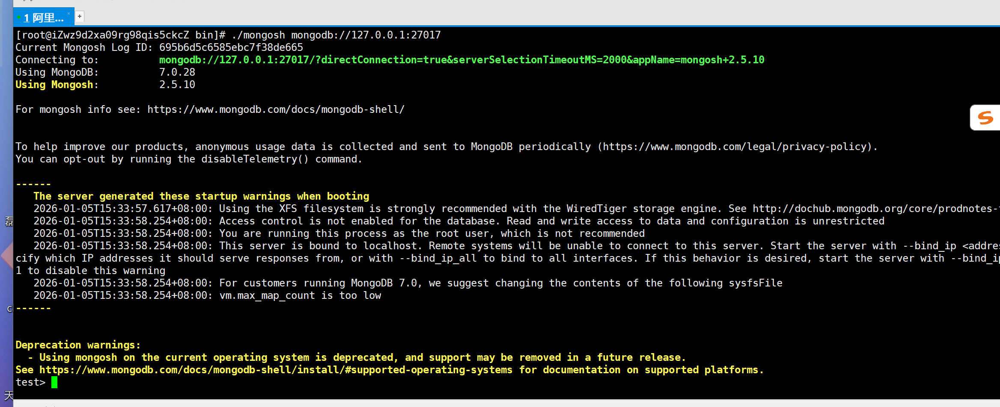

```shell
# 切换admin
use admin
#创建管理员用户，并设置密码与权限
db.createUser({user:'admin', pwd: 'a123456',roles:[{role:'root',db:'admin'}]})
# 验证
db.auth('admin','a123456')
```
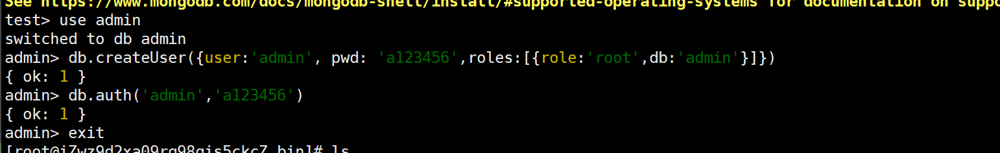

### 4、远程连接
注：云服务需要开放27017端口
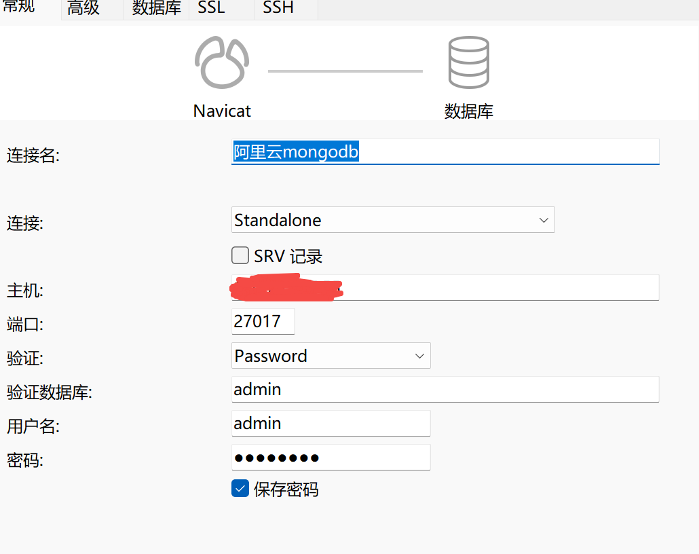


