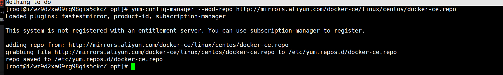

# docker 学习
参考文献：https://cloud.tencent.com/developer/article/2393736

## 一、yum docker 安装
### 1、安装
删除原有
```shell
sudo yum remove docker \
docker-client \
docker-client-latest \
docker-common \
docker-latest \
docker-latest-logrotate \
docker-logrotate \
docker-engine
```

安装
```shell
sudo yum install -y yum-utils
sudo yum-config-manager --add-repo https://download.docker.com/linux/centos/docker-ce.repo
sudo yum install docker-ce docker-ce-cli containerd.io docker-buildx-plugin docker-compose-plugin
```


### 2、修改镜像加速

```shell
sudo tee /etc/docker/daemon.json <<-'EOF'
{
"registry-mirrors": [
"https://alzgoonw.mirror.aliyuncs.com",
"https://docker.m.daocloud.io",
"https://dockerhub.icu",
"https://docker.anyhub.us.kg",
"https://docker.1panel.live"
]
}
EOF
```
重新加载配置
sudo systemctl daemon-reload

启动
systemctl start docker
默认启动
systemctl enable docker
重启
sudo systemctl restart docker

## 二、常见命令
### 1、docker 命令
```shell
systemctl start docker     #启动docker    
systemctl stop docker      #关闭docker    
systemctl restart docker   #重启docker    
systemctl enable docker    #设置开机自启动     
systemctl status docker    #查看docker运行状态    
docker version             #查看docker版本号信息   
docker info 
docker --help              #docker命令提示  
```

### 2、镜像命令

#### 查看镜像
```shell
docker images  #查看镜像    
```

#### 从服务器拉取镜像拉取镜像    
```shell
docker pull 镜像名       #拉取最新版本的镜像        
docker pull 镜像名:tag   #拉取镜像，指定版本    
```

#### 推送镜像到服务
```shell
docker push 镜像名     
docker push 镜像名:tag

docker save -o 保存的目标文件名称 镜像名 #保存镜像为一个压缩包
docker load -i 文件名    #加载压缩包为镜像
```

#### 从Docker Hub查找/搜索镜像     
```shell
docker search [options] TERM         
docker search -f STARS=9000 mysql  #搜索stars收藏数不小于10以上的mysql镜像
```


#### 删除镜像。当前镜像没有被任何容器使用 才可以删除
```shell
docker rmi 镜像名/镜像ID     #删除镜像   
docker rmi -f 镜像名/镜像ID  #强制删除   
docker rmi -f 镜像名 镜像名 镜像名     #删除多个 其镜像ID或镜像用用空格隔开即可    
docker rmi -f $(docker images -aq)  #删除全部镜像，-a 意思为显示全部, -q 意思为只显示ID 

docker image rm 镜像名称/镜像ID  #强制删除镜像  
```

#### 给镜像打标签【有时候根据业务需求 需要对一个镜像进行分类或版本迭代操作，此时就需要给镜像打上标签】
docker tag SOURCE_IMAGE[:TAG] TARGET_IMAGE[:TAG]

### 3、容器命令
#### 容器保护三个状态：
运行：进程正常运行   
暂停：进程暂停，CPU不再运行，并不释放内存  
停止：进程终止，回收进程占用的内存、CPU等资源    

其中：
docker run：创建并运行一个容器，处于运行状态     
docker pause name：让一个运行的容器暂停    
docker unpause name：让一个容器从暂停状态恢复运行  
docker stop name：停止一个运行的容器（杀死进程、回收内存，仅剩文件系统）    
docker start name：让一个停止的容器再次运行  
docker restart name：重启容器    
docker rm：删除一个容器（进程、内存回收、文件系统彻底干掉）  
```shell
docker ps      #显示正在运行的容器
docker ps -a   #-a,--all  显示全部容器，包括已停止的（默认只显示运行中的容器）

#容器怎么来？ docker run 创建并运行一个容器，处于运行状态。
#--name 给要运行的容器起的名字；   -p 将宿主机端口与容器端口映射，冒号左侧是宿主机端口，右侧是容器端口；   -d 表示可后台运行容器 （守护式运行）。具体样例见下
docker run --name containerName -p 80:80 -d nginx   

docker pause 容器名/容器ID    #让一个运行的容器暂停
docker unpause name  #让一个容器从暂停状态恢复运行
docker stop name     #停止一个运行的容器（杀死进程、回收内存，仅剩文件系统）
docker start name    #让一个停止的容器再次运行
docker restart name  #重启容器
#docker stop与docker kill的区别：都可以终止运行中的docker容器。类似于linux中的kill和kill -9这两个命令，docker stop与kill相似，docker kill与kill -9类似
docker kill 容器名    #杀掉一个运行中的容器
docker rename 容器名 新容器名  #更换容器名

#删除容器
docker rm 容器名/容器ID            #删除容器  
docker rm -f CONTAINER           #强制删除
docker rm -f 容器名 容器名 容器名   #删除多个容器 空格隔开要删除的容器名或容器ID
docker rm -f $(docker ps -aq)    #删除全部容器


docker logs 容器名        #查看容器运行日志         
docker logs -f 容器名     #持续跟踪日志
docker logs -f --tail=20 容器名  #查看末尾多少行


#进入容器执行命令，两种方式 docker exec 和 docker attach，推荐docker exec
#方式一 docker exec。
docker exec -it 容器名/容器ID bash
#方式二 docker attach，推荐使用docker exec
docker attach 容器名/容器ID

#从容器退到自己服务器中（不能用ctrl+C）
exit      #直接退出。未添加-d(持久化运行容器)时，执行此参数 容器会被关闭
ctrl+p+q  #优雅退出。无论是否添加-d参数，执行此命令容器都不会被关闭

```

## 三、数据卷
数据卷（volume）是一个虚拟目录，指向宿主机文件系统中的某个目录。
可供容器使用的特殊目录，可以在容器之间共享和重用        
对数据卷的修改会立即生效，对数据卷的更新 不会影响镜像     
卷会一直存在，直到没有容器使用   


一旦完成数据卷挂载，对容器的一切操作都会作用在数据卷对应的宿主机目录了。
这样，我们操作宿主机的/var/lib/docker/volumes/html目录，就等于操作容器内的/usr/share/nginx/html目录了。
两个文件挂载同一个数据卷，数据共享；升级 容器删了，但数据卷没删、硬盘目录还在

### 1、挂载数据卷
可挂载到容器目录，也可以挂载到本地目录

创建容器，挂载数据卷示例：
```shell
docker run \
  --name mn \
  -v html:/root/html \
  -p 8080:80
  nginx 
```
这里的-v就是挂载数据卷的命令：
-v volumeName:/targetContainerPath      如果容器运行时volume不存在，会自动被创建出来。大多情况下不用自己手动创建数据卷，由docker自动完成
-v html:/root/htm                      ：把html数据卷挂载到容器内的/root/html这个目录中
容器内新建、删除、修改文件——宿主机外部挂载的目录同步
容器删除——宿主机外部挂载的目录不会同步【不会因为容器的删除 而删除其挂载在外部宿主机的目录】

